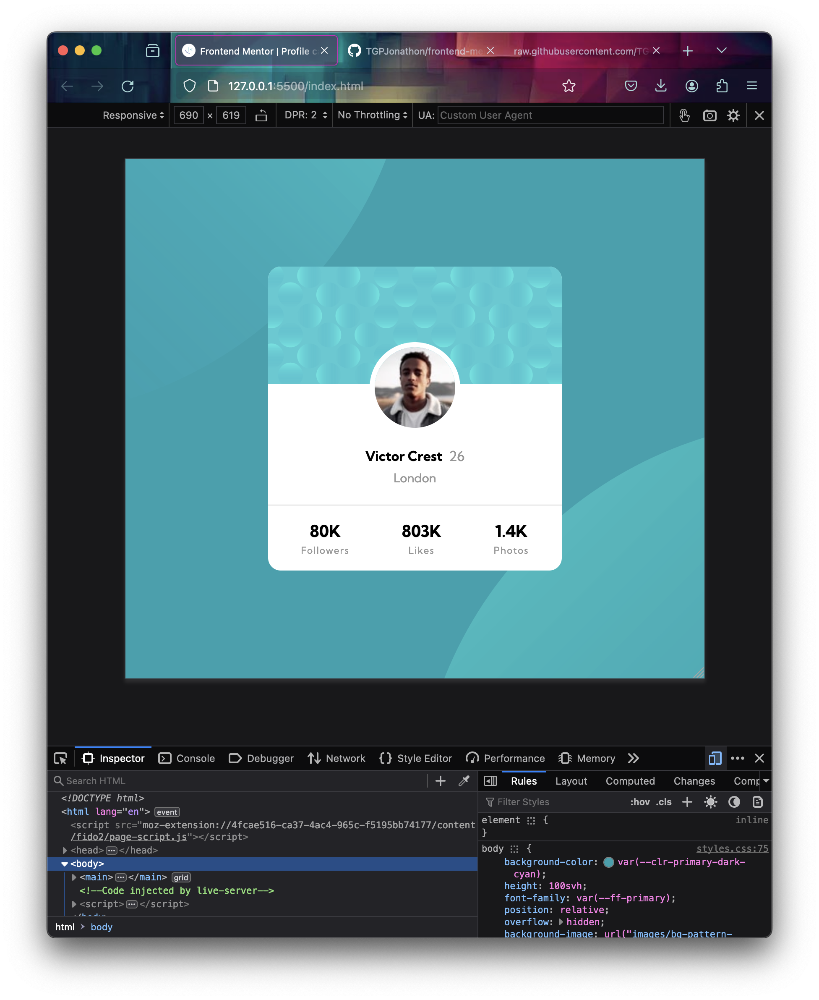

# Frontend Mentor - Profile card component solution

This is a solution to the [Profile card component challenge on Frontend Mentor](https://www.frontendmentor.io/challenges/profile-card-component-cfArpWshJ). Frontend Mentor challenges help you improve your coding skills by building realistic projects.

## Table of contents

- [Overview](#overview)
  - [Screenshot](#screenshot)
  - [Links](#links)
- [My process](#my-process)
  - [Built with](#built-with)
  - [What I learned](#what-i-learned)
  - [Continued development](#continued-development)

## Overview

This one was fairly easy to finish, but the background circles took me a while to get. I ended up doing a lot of googling for that part.

### Screenshot

### Links

- Solution URL: [https://github.com/TGPJonathon/frontend-mentor-profile-card](https://github.com/TGPJonathon/frontend-mentor-profile-card)
- Live Site URL: [https://tgpjonathon.github.io/frontend-mentor-profile-card/](https://tgpjonathon.github.io/frontend-mentor-profile-card/)

## My process

### Built with

- Semantic HTML5 markup
- CSS custom properties
- Flexbox

### What I learned

I learned about the background position css property for working with and positioning background images.

### Continued development

Still want to get better at Grid & Flex. Trying to be the Kevin Powell of CSS one day.
